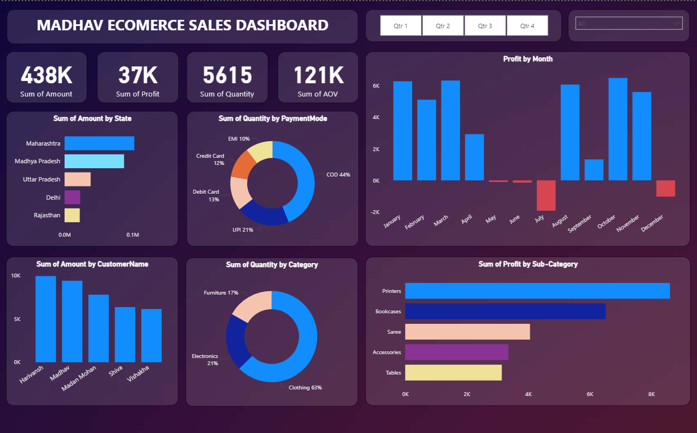

# PowerBI-Project---ECOMERCE-SALES-DASHBOARD
An interactive Power BI dashboard analyzing e-commerce sales data to track profitability, customer trends, and regional performance. Features include real-time KPI tracking (AOV, Profit, Quantity) and multi-dimensional analysis by payment mode, category, and state.

# E-Commerce Sales Dashboard - Power BI

## Project Overview
This project involved creating an interactive dashboard to track and analyze the performance of an e-commerce business. The primary goal was to provide stakeholders with a clear view of profitability, customer trends, and regional sales performance across various product categories.

## Key Features & Insights
* **Comprehensive KPI Tracking:** Monitor crucial metrics including Total Amount (438K), Total Profit (37K), and Average Order Value (AOV).
* **Profitability Analysis:** Identified **Printers** and **Bookcases** as the most profitable sub-categories, driving significant business growth.
* **Customer Segmentation:** Analyzed purchasing behavior of top customers such as **Harivansh** and **Madhav**.
* **Market Trends:** * **Category Dominance:** Clothing is the largest category, accounting for **63%** of total sales.
    * **Payment Preferences:** Cash on Delivery (COD) is the preferred method for **44%** of customers.
    * **Regional Performance:** Maharashtra and Madhya Pradesh emerged as the leading states in sales volume.

## Visualizations

## Technical Stack
* **Tool:** Power BI Desktop
* **Data Source:** E-commerce Sales Dataset 
* **Features Used:** DAX for calculated measures, interactive filters (Slicers), and custom visualization formatting.
* **Dataset:** Included in the repository as `Details.csv` and `Orders.csv`.

## How to Use
1. Download the `Ecommerce_Sales_Dashboard.pbix` file from this repository.
2. Open it using **Power BI Desktop**.
3. Use the slicers (Quarter, State) to filter the data and explore different business scenarios.
